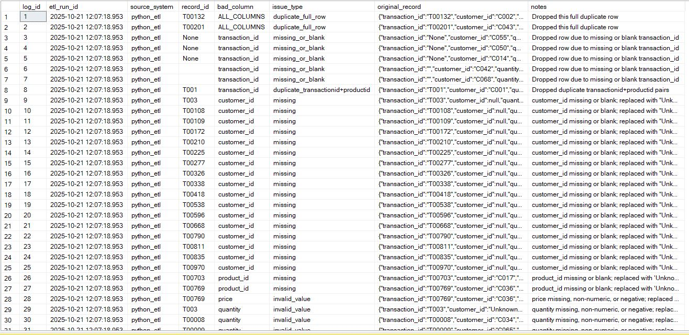
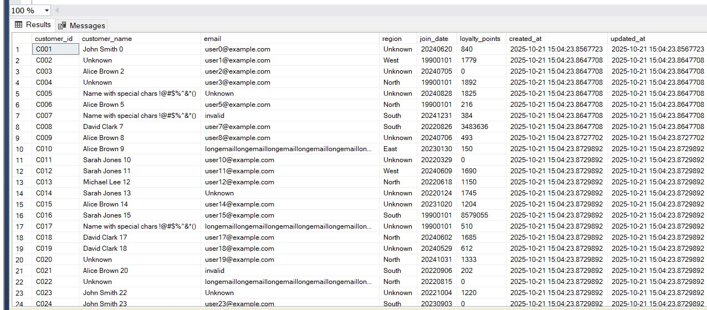
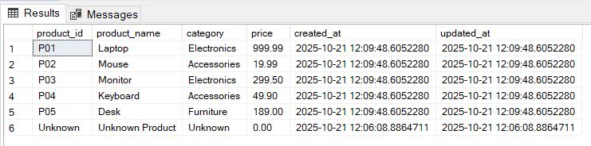
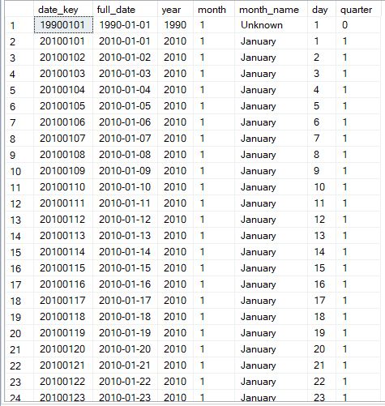
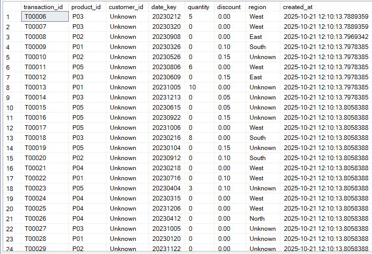

### Data Generation & Scaling

To create a sufficiently large dataset for testing the Python ETL pipeline, the original JSON dataset containing 5 sales records was scaled to more than **1,000 records**. 
The scaling process involved duplicating and modifying entries with randomized values while preserving realistic business scenarios.

**Key aspects of the generated dataset:**

- **Customer Variation:** Customer IDs range from C001 to C070, with some records having `null` to simulate missing customers. This tests the ETL pipeline's ability to handle unknown or missing dimension records.  
- **Product Variation:** Includes multiple product categories (`Electronics`, `Accessories`, `Furniture`) and some product names with special characters to validate text handling.  
- **Quantity & Discount:** Randomized positive, zero, negative, and missing values. Discounts include valid percentages, zero, negative, and null values. This introduces **data quality challenges** for ETL validation.  
- **Date Formats:** Randomized transaction dates within 2023 using multiple formats (`YYYY/MM/DD HH:MM:SS`, `YYYY-MM-DDTHH:MM:SSZ`, `DD-MM-YYYY`, `YYYY-MM-DD`) to test date parsing and standardization.  
- **Region:** Transactions are assigned regions (`North`, `South`, `East`, `West`) and some records have `null` or `Unknown` to test handling of missing or invalid categorical data.  

**Purpose:**  
The generated dataset includes deliberate inconsistencies and edge cases to ensure the ETL pipeline can handle **missing values, invalid numeric fields, inconsistent date formats, and unknown categories**, 
while correctly logging or defaulting them during the load process.

# Python ETL Pipeline for Sales Data

## Part 1: Overview

This Python-based ETL pipeline processes semi-structured sales data from a JSON source (`sales_data.json`) and incrementally loads it into a SQL Server relational database (`SalesDB`). The pipeline handles data extraction, validation, cleansing, transformation, and incremental loading into dimension and fact tables.

**Objectives:**

- Extract JSON data using Python and pandas.
- Clean and transform data for analytical use.
- Log and handle bad or inconsistent data.
- Implement incremental loads into `DimProduct`, `DimDate`, and `FactSales`.
- Maintain data quality and audit trail via a `BadDataLog` table.

---

## Part 2: Logging Configuration

The ETL pipeline maintains detailed logs for tracking process execution and data quality issues:

- Logs are stored in the `code_logs/` directory.
- Log file for each run: `code_logs/sales_etl_code_execution_logs.log`.
- Logging captures both **info** and **error** messages.
- Helper function `log_print()` ensures messages are both printed and logged.

**Key points:**

- Tracks start and end of ETL job.
- Logs number of records processed in each step.
- Records invalid or missing data for later analysis.

---

## Part 3: SQL Server Connection

The pipeline connects to SQL Server using `pyodbc`:

- Database: `SalesDB`
- Connection via trusted connection.
- Logs success or failure of database connection.
- Handles exceptions with proper logging.

---

## Part 4: Loading JSON Data

- Reads the JSON source file and converts it to a pandas DataFrame.
- Logs total records loaded.
- Handles malformed JSON with error logging.

---

## Part 5: Data Validation, Cleansing & Transformation

### 5.1 Duplicate Rows

- Identifies exact duplicates and logs them to `BadDataLog`.
- Removes duplicate rows from DataFrame.

### 5.2 Transaction ID Cleaning

- Strips whitespace and ensures string type.
- Drops or logs missing/blank transaction IDs.
- Removes duplicate `(transaction_id, product_id)` combinations.

### 5.3 Customer ID Cleaning

- Converts to string, strips whitespace, and replaces placeholders (`None`, `nan`) with `Unknown`.
- Logs original missing values before replacement.

### 5.4 Product Columns Cleaning

- Cleans and validates `product_id`, `product_name`, `category`, and `price`.
- Replaces missing or invalid values with `Unknown` (or 0 for numeric fields).
- Logs all bad/missing values for auditing.

### 5.5 Quantity & Discount

- Converts to numeric, handles missing or negative values by replacing them with 0.
- Logs rows with invalid quantity or discount.

### 5.6 Date Parsing

- Handles multiple date formats (`YYYY/MM/DD`, `YYYY-MM-DD`, `DD-MM-YYYY`, etc.).
- Invalid or missing dates replaced with `1990-01-01`.
- Logs invalid or blank dates for review.

### 5.7 Region

- Strips whitespace and replaces missing/invalid regions with `Unknown`.
- Logs affected rows to `BadDataLog`.

---

## Part 6: Incremental Data Load

### 6.1 DimProduct

- Extracts unique products from cleaned sales data.
- Compares against existing `DimProduct` records.
- Inserts new products and updates existing products with changed attributes.
- Type casting ensures compatibility with database schema.

### 6.2 DimDate

- Generates a date dimension from `2010-01-01` to `2030-12-31`.
- Creates columns: `date_key`, `full_date`, `year`, `month`, `month_name`, `day`, `quarter`.
- Populates `DimDate` only if the table is empty to avoid duplication.
- Inserts rows in batches for efficiency.

### 6.3 FactSales

- Selects required columns from cleaned DataFrame.
- Handles composite key duplicates (`transaction_id`, `product_id`) by logging and removing duplicates before load.
- Validates `customer_id` against `DimCustomer`, replacing invalid or non-existent IDs with `Unknown`.
- Implements **incremental load** logic:
  - Fetches existing `(transaction_id, product_id)` pairs from `FactSales`.
  - Compares against new records to identify only **new rows** for insertion.
  - Ensures **idempotency**: re-running the ETL does not create duplicates.
- Inserts new rows in **batches** for performance efficiency.
- Logs all steps, including number of new records inserted and any dropped duplicates.
- Maintains a complete **audit trail** for data quality and incremental updates.

---

## Part 7: Bad Data Logging

All invalid or inconsistent data encountered during cleaning and transformation is logged to the `BadDataLog` table:

- Columns captured: `etl_run_id`, `source_system`, `record_id`, `bad_column`, `issue_type`, `original_record`, `notes`.
- Types of issues logged:
  - Missing values
  - Invalid formats
  - Negative or non-numeric values
  - Duplicate rows or composite keys

This ensures **auditability** and enables data quality monitoring.

---

## Part 8: ETL Run Summary

- The pipeline prints and logs the number of records processed in each step.
- All transformations, replacements, and cleansing steps are tracked.
- Incremental loading ensures **idempotency**, avoiding duplicate inserts.

---

## Part 9: Data Quality Considerations

- Multiple invalid/missing scenarios are intentionally tested in the dataset:
  - Missing `customer_id` → replaced with `Unknown`
  - Negative `quantity` and `discount` → replaced with 0
  - Invalid `price` → replaced with 0
  - Blank or malformed `transaction_id` and `product` fields → logged and replaced
  - Multiple date formats → standardized to `YYYYMMDD`
  - Missing/unknown regions → replaced with `Unknown`
- These measures validate ETL resilience and logging completeness.

---

## Part 10: Execution Notes

- The pipeline is executed as a Python Jupyter notebook.
- All logs are stored for audit purposes.
- Database connections are maintained.
- Incremental logic ensures only new or updated records are loaded.

## Part 11: Screenshots

## Raw Input Data
Below is a sample of the original raw Sales JSON data loaded into the DataFrame:

### 3. ETL Log File Outputs
Logs file capture ETL process execution, including data validation, cleansing, and incremental load steps:

### 4. Bad Data Logging Table
Rows with missing, invalid, or duplicate values were logged into the `BadDataLog` table:

### 5. Target Tables
After ETL, data was loaded into dimension and fact tables. Sample data from these tables:

#### DimCustomer (From SSSIS Pipeline)

#### DimProduct

#### DimDate

#### FactSales

---
