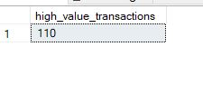

# Part 2: Database Design and Querying

## 2.1 Objective
Designed a normalized, efficient database schema to store sales and customer data and implemented analytical SQL queries.  
Focussed on **referential integrity**, **incremental loads**, handling **unknown/missing records**, and **query performance optimization**.

---

## 2.2 Database Model

- **Database:** `SalesDB`  
- **Schema:** `dbo`  
- **Tables:**
  - **Dimensions:** `DimCustomer`, `DimProduct`, `DimDate`
  - **Fact Table:** `FactSales`
  - **Logs:** `BadDataLog`  
- **Views:** `vw_DimDate` – filters dates from 2010 onwards. Added this view to be used as Date table in Power BI.

### 2.2.1 Dimensional Modeling
- **Fact Table (`FactSales`)**
  - Stores transactional data: `transaction_id`, `product_id`, `customer_id`, `date_key`, `quantity`, `discount`, `region`.
  - Composite primary key: `(transaction_id, product_id)`.
  - Foreign keys link to dimensions to enforce relationships.

- **Dimension Tables**
  - **`DimCustomer`**: customer details (name, email, region, join_date, loyalty points).  
    - Unknown customer record added for invalid/missing references.
  - **`DimProduct`**: product details (name, category, price).  
    - Unknown product record added similarly.
  - **`DimDate`**: date attributes (day, month, quarter, year).  
    - Unknown date record inserted as placeholder.

- **Log Table (`BadDataLog`)**
  - Stores rejected/corrected records with metadata: ETL run, source, column, issue type, and original record.
  - Supports traceability and debugging.

### 2.2.2 Design Considerations
- **Normalization:** Dimensions separate descriptive attributes; fact table only stores measures and keys.  
- **Incremental Loads:** Fact table inserts only new transactions. Dimensions follow **SCD 0** (overwrite updates).  
- **Referential Integrity:** Unknown records ensure all facts have valid dimension references.  
- **Relationships:**  
  - `FactSales.customer_id → DimCustomer.customer_id`  
  - `FactSales.product_id → DimProduct.product_id`  
  - `FactSales.date_key → DimDate.date_key`

---

## 2.3 Indexes and Optimization

| Table | Index | Purpose |
|-------|-------|---------|
| `DimCustomer` | `IX_DimCustomer_Region_JoinDate` | Fast filtering and grouping by region and join date |
| `DimProduct` | `IX_DimProduct_Category` | Optimize category-level queries |
| `DimDate` | `IX_DimDate_YearMonth` | Speed up monthly trend analysis |
| `FactSales` | `IX_FactSales_Region_Date` | Filter by region and date efficiently |
| `FactSales` | `IX_FactSales_Customer_Product` | Joins with customer/product dimensions faster |
| `BadDataLog` | `IX_BadData_ETLRun_Source` | Quickly identify ETL runs per source |
| `BadDataLog` | `IX_BadData_RecordId` | Locate specific bad records |
| `BadDataLog` | `IX_BadData_ETLRun_Column` | Analyze column-specific ETL issues |

- **Purpose:** Indexes reduce table scans and improve query performance for aggregation, filtering, and joins.

---

## 2.4 Analytical Queries

### 2.4.1 Query 1: Total Sales by Region and Category
sql
SELECT 
    f.region,
    p.category,
    CAST(ROUND(SUM(f.quantity * p.price * (1 - ISNULL(f.discount,0))), 2) AS DECIMAL(18,2)) AS total_sales
FROM [SalesDB].[dbo].[FactSales] f
JOIN [SalesDB].[dbo].[DimProduct] p ON f.product_id = p.product_id
GROUP BY f.region, p.category
ORDER BY f.region, p.category;

**Explanation:**  
- Aggregates total sales per region and product category.  
- Joins `FactSales` with `DimProduct` to get category information.  
- Uses `ISNULL` to handle null discounts.  

**Optimization / Index Use:**  
- Uses `IX_FactSales_Region_Date` indirectly when filtering by region.  
- `IX_DimProduct_Category` helps speed up the join and aggregation by category.

### 2.4.2 Query 2: Top 5 Products by Total Revenue
SELECT TOP 5
    p.product_name,
    CAST(ROUND(SUM(f.quantity * p.price * (1 - ISNULL(f.discount,0))), 2) AS DECIMAL(18,2)) AS total_revenue
FROM [SalesDB].[dbo].[FactSales] f
JOIN [SalesDB].[dbo].[DimProduct] p ON f.product_id = p.product_id
GROUP BY p.product_name
ORDER BY total_revenue DESC;

**Explanation:**  
- Calculates total revenue per product and returns top 5.  
- Useful for product performance analysis.  

**Optimization / Index Use:**  
- Join on `product_id` leverages `PK_FactSales` and `DimProduct` primary key.  
- `IX_DimProduct_Category` indirectly helps for grouped queries by product attributes.

### 2.4.3 Query 3: Monthly Sales Trend
SELECT 
    d.year,
    d.month,
    CAST(ROUND(SUM(f.quantity * p.price * (1 - ISNULL(f.discount,0))), 2) AS DECIMAL(18,2)) AS monthly_sales
FROM [SalesDB].[dbo].[FactSales] f
JOIN [SalesDB].[dbo].[DimProduct] p ON f.product_id = p.product_id
JOIN [SalesDB].[dbo].[DimDate] d ON f.date_key = d.date_key
GROUP BY d.year, d.month
ORDER BY d.year, d.month;

**Explanation:**  
- Aggregates sales per month to visualize trends.  
- Joins `DimDate` for proper year/month breakdown.  
- Joins `DimProduct` to get product price.

**Optimization / Index Use:**  
- `IX_FactSales_Region_Date` not used directly, but any date-based filtering can leverage it.  
- `IX_DimDate_YearMonth` supports fast grouping by year and month.

### 2.4.4 Query 4: Average Discount Percentage per Region
SELECT 
    region,
    CAST(ROUND(AVG(ISNULL(discount,0)) * 100, 2) AS DECIMAL(18,2)) AS avg_discount_percentage
FROM [SalesDB].[dbo].[FactSales]
GROUP BY region
ORDER BY region;

**Explanation:**  
- Computes the average discount applied to transactions per region.  
- Null discounts are treated as 0 for calculation.  

**Optimization / Index Use:**  
- `IX_FactSales_Region_Date` helps speed up grouping by region.

### 2.4.5 Query 5: Number of High-Value Transactions (>$1000)
SELECT 
    COUNT(*) AS high_value_transactions
FROM [SalesDB].[dbo].[FactSales] f
JOIN [SalesDB].[dbo].[DimProduct] p ON f.product_id = p.product_id
WHERE (f.quantity * p.price * (1 - ISNULL(f.discount,0))) > 1000;

**Explanation:**  
- Counts transactions exceeding $1000 in total value.  
- Useful for identifying large orders or VIP customer behavior.  

**Optimization:**  
- Join leverages `PK_FactSales` and `DimProduct` primary key. 

## 2.5 Screen shots of query results

## 2.5.1 Query 1:

## 2.5.2 Query 2:

## 2.5.3 Query 3:

## 2.5.4 Query 4:

## 2.5.5 Query 5:

---