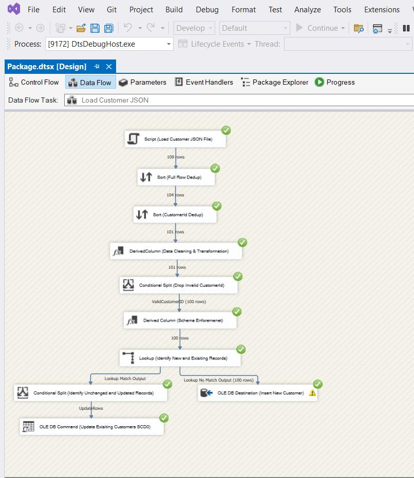
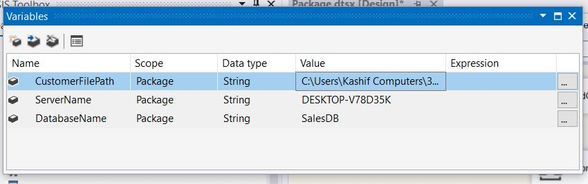
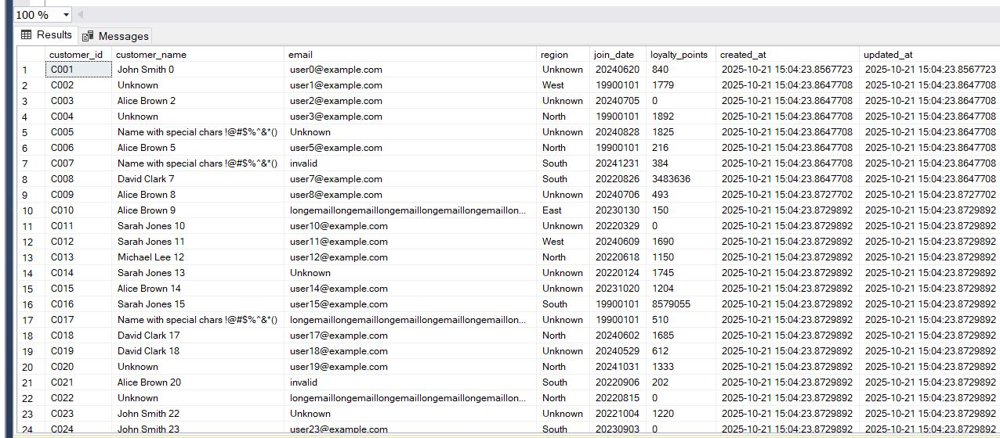
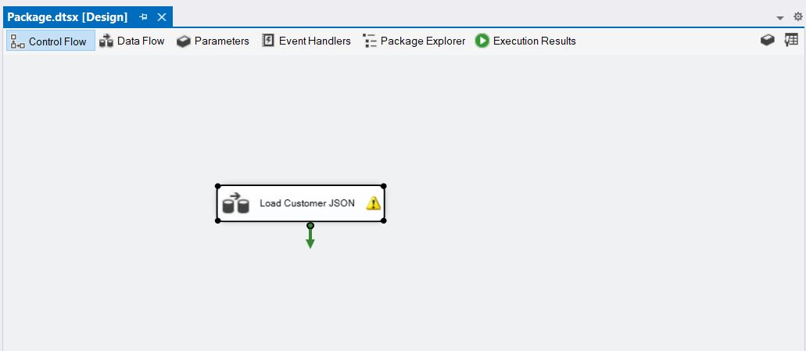
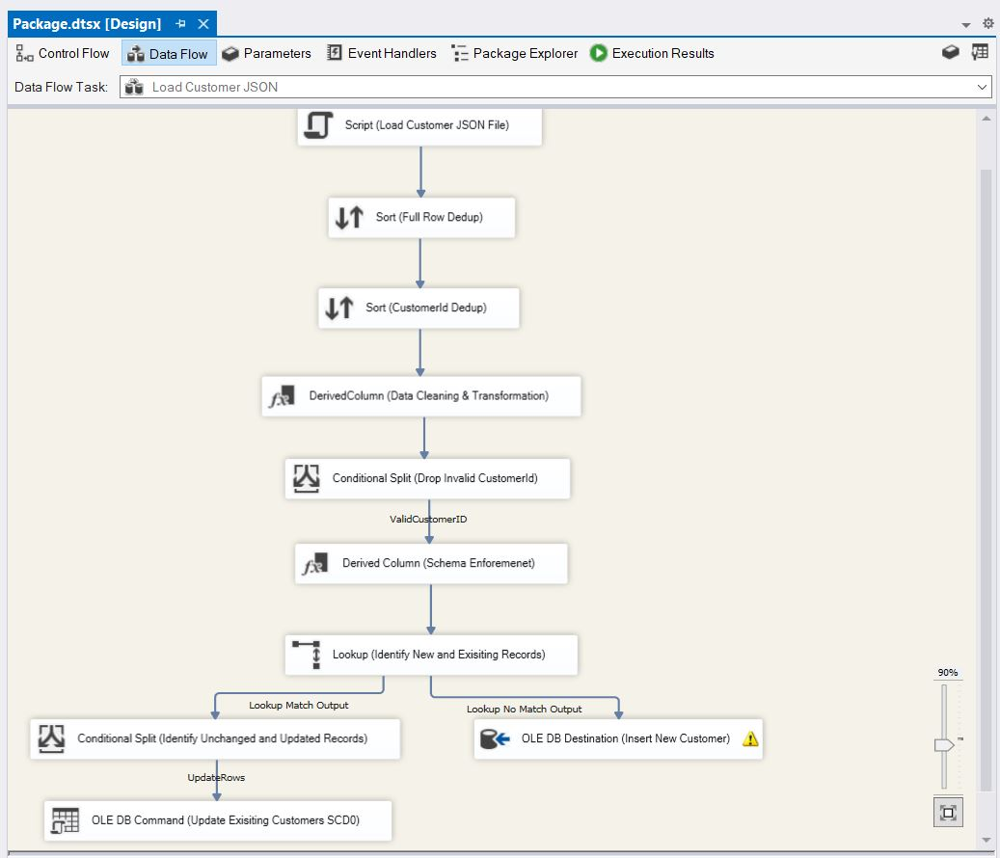

## Part 3: SSIS Pipeline - Customer JSON Processing

### Overview

This SSIS package is designed to process customer data from a JSON file (`customer_data.json`) and load it into the SQL `DimCustomer` table, ensuring data quality, schema consistency, and incremental updates. The pipeline is built with efficient data loading, processing and SCD0 logic for existing records.

**Pipeline Highlights:**
- **Control Flow:** A single container/task named `Load Customer JSON` orchestrates the entire data flow.
- **Data Flow Tasks:**  
  1. **Script (Load Customer JSON File):** Reads the JSON file into SSIS for processing.  
  2. **Sort (Full Row Deduplication):** Removes complete duplicate rows to ensure unique data.  
  3. **Sort (CustomerId Deduplication):** Ensures each primary key `CustomerId` appears only once.  
  4. **Derived Column (Data Cleaning & Transformation):** Cleans and transforms data (e.g., null replacements, negative numeric       handling, trims spaces, converts types).  
  5. **Conditional Split (Drop Invalid CustomerId):** Filters out records with null or malformed `CustomerId`.  
  6. **Derived Column (Schema Enforcement):** Ensures data conforms to the destination table schema.  
  7. **Lookup (Identify New and Existing Records):** Determines which customers already exist in the database.  
  8. **OLE DB Destination (Insert New Customers):** Inserts new customer records into the table.  
  9. **Conditional Split (Identify Unchanged vs Updated Records):** Separates unchanged records from those needing updates.  
  10. **OLE DB Command (Update Existing Customers - SCD0):** Updates existing customer records in-place using SCD0 logic.

**Key Features:**
- **Incremental Loading:** Only new or changed records are processed for insertion or update.  
- **Data Validation:** Invalid records are filtered and can be logged for auditing.  
- **Error Logging:** Errors and bad data can be captured in a dedicated ErrorLog table or file if wanted.  
- **Scalability:** Parameters for input file path allow easy configuration for different environments. It can also be extended to Connection paramters.  

This pipeline ensures clean, consistent, and up-to-date customer data in the target SQL database.

### Pipeline Components Detailed Explanation

### SSIS Pipeline: Customer JSON Load

#### 1. Script Component: Load Customer JSON File

**Purpose:**  
This Script Component serves as the source for loading customer data from a JSON file (`customer_data.json`). The file path is stored in the SSIS variable `CustomerFilePath`, allowing flexibility in different environments.  

**Functionality:**  
- Reads and parses the JSON file.  
- Loads all columns as strings to preserve data without truncation.  
- Handles nulls safely by assigning empty strings or default values.  
- Feeds the data into the pipeline for downstream transformations.

**Impact:**  
- Ensures full data capture from JSON.  
- Provides a consistent starting point for data cleaning, deduplication, and transformations.

---

#### 2. Sort Component: Full Row Dedup

**Purpose:**  
Removes complete duplicate rows from the input data.  

**Functionality:**  
- Compares all columns in a row to identify duplicates.  
- Only allows unique rows to pass to the next component.

**Impact:**  
- Improves overall data quality.  
- Reduces unnecessary downstream processing.

---

#### 3. Sort Component: CustomerId Dedup

**Purpose:**  
Ensures that each `customer_id` is unique before inserting into the SQL Customers table, maintaining primary key integrity.  

**Functionality:**  
- Sorts the dataset by `customer_id`.  
- Keeps only the first occurrence of each `customer_id`.  
- Eliminates duplicates that could cause insert failures.

**Impact:**  
- Prevents primary key violations in the target table.  
- Guarantees that only one record per customer is processed further in the pipeline.

---

#### 4. Derived Column: Data Cleaning & Transformation

**Purpose:**  
This component performs data validation, cleaning, and standardization on incoming customer data to ensure all columns conform to the target database schema before insertion.

**Transformations Applied:**  

- **Customer Name:**  
  - If null or empty → `"Unknown"`  
  - If length > 255 → truncate to first 255 characters  
  - Otherwise, keep original value  

- **Region:**  
  - If null or empty → `"Unknown"`  
  - Otherwise, keep original value  

- **Email:**  
  - If null or empty → `"Unknown"`  
  - If missing `"@"` → `"invalid"`  
  - If length > 320 → truncate to first 320 characters  
  - Otherwise, keep original value  

- **Loyalty Points:**  
  - If null or empty → `"0"`  
  - If negative → `"0"`  
  - Otherwise, keep original value  

- **Join Date:**  
  - If null, empty, or invalid format → `"19900101"`  
  - If length ≥ 10 → take first 10 characters and remove `"-"` or `"/"`  
  - Otherwise, default to `"19900101"`  

**Impact / Benefits:**  
- Ensures all fields meet the target database schema requirements.  
- Prevents insertion of invalid, empty, or malformed data.  
- Provides consistent default values for missing or incorrect fields, supporting referential integrity and downstream ETL processes.

---

#### 5. Conditional Split: Drop Invalid CustomerId

**Purpose:**  
This component filters out rows where the `customerid` is null, empty, or missing. Ensuring only valid customer IDs are processed helps maintain referential integrity with the target `DimCustomer` table.

**Condition Applied:**  
- `LEN(TRIM(customerid)) > 0`  
  - Rows meeting this condition are passed downstream.  
  - Rows failing this condition are discarded or logged as invalid.

**Impact / Benefits:**  
- Prevents insertion of invalid records into the customer dimension.  
- Reduces downstream errors and maintains data quality in the ETL pipeline.  

---

#### 6. Derived Column: Schema Enforcement

**Purpose:**  
This component enforces the target schema on all columns to match the `DimCustomer` table requirements.  

**Transformations Applied:**  
- Converts string columns to `DT_WSTR` with maximum lengths matching target table.  
- Converts numeric columns to integer (`DT_I4`) or decimal types as per schema.  
- Ensures all fields conform to type and length constraints before database insertion.

**Impact / Benefits:**  
- Guarantees data type and length consistency with the target table.  
- Prevents runtime errors during insertion due to type mismatches.  
- Supports SCD operations and other downstream ETL tasks by ensuring clean, correctly-typed data.

---

#### 7. Lookup: Identify New and Existing Records

**Purpose:**  
This component identifies which rows from the incoming data already exist in the target `DimCustomer` table and which are new.  

**Logic Applied:**  
- Lookup is performed based on `customerid`.  
- Rows not found in the target are flagged as **new**.  
- Rows found in the target are flagged as **existing**.  

**Impact / Benefits:**  
- Allows incremental loading of only new records.  
- Ensures existing records are further checked for updates (SCD0 approach).  

---

#### 8. OLE DB Destination: Insert New Customer

**Purpose:**  
This component receives new customer rows from the Lookup component and inserts them into the target `DimCustomer` table.  

**Impact / Benefits:**  
- Efficiently loads only new customers.  
- Maintains referential integrity with other fact tables.  

---

#### 9. Conditional Split: Identify Unchanged and Updated Records

**Purpose:**  
Filters existing records from the Lookup output into **unchanged** and **updated** sets.  

**Condition Applied:**  
customername != Lookup_customer_name 
|| email != Lookup_email 
|| region != Lookup_region 
|| (DT_I4)joindate != (DT_I4)Lookup_join_date 
|| (DT_I4)loyaltypoints != (DT_I4)Lookup_loyalty_points

**Logic Applied:**
- Rows meeting the condition are updated.
- Rows failing the condition are unchanged and ignored.

**Impact / Benefits:**  
- Minimizes unnecessary updates to unchanged records.
- Supports SCD0 logic for immediate overwrite of updated records.
- Ensures only modified rows are sent to the OLE DB Command for update.

---

#### 10. OLE DB Command: Update Existing Customers (SCD0)

**Purpose:**  
This component updates existing customer records in the target table using **SCD0 logic**, meaning it overwrites current values with the latest data.

**Query Used:**  
UPDATE dbo.DimCustomer
SET
    customer_name = ?,
    email = ?,
    region = ?,
    join_date = ?,
    loyalty_points = ?
WHERE customer_id = ?

**Impact / Benefits:**  
- Ensures that only the records identified as updated by the previous Conditional Split are modified.
- Maintains current values without tracking history (SCD0).
- Efficient for incremental updates while minimizing unnecessary writes.

---

## Screenshots

**Pipeline Successfull Run View**

**Pipeline Variables**

**Target Table View**

**Pipeline Control Flow View**

**Pipeline Data Flow View**

---

This completes the SSIS Customer JSON pipeline documentation. The pipeline is designed with scaling in mind: using SSIS variable for file path, Lookup and Conditional Split components minimize unnecessary database operations, and batch-friendly OLE DB Destinations ensure efficient inserts. For larger datasets, additional partitioning and parallel execution can be implemented to improve performance.
---

